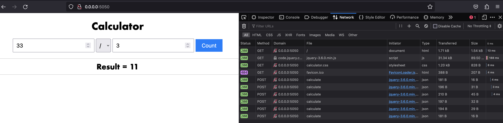

# Flask Calculator Application

This is a simple Flask calculator application that provides basic arithmetic operations: addition, subtraction, multiplication, and division. The application uses a strategy pattern to handle different calculation operations.

## Installation and Usage

1. Clone the repository to your local machine:

```bash
git clone git@github.com:VladyslavHnatchenko/flask-calculator-app.git
cd flask-calculator-app/src
```

## Docker Support

```bash
docker build -t flask-calculator-app .
docker run -it -p 5050:5050 -d flask-calculator-app
```

Access the application in your web browser at http://0.0.0.0:5050/

